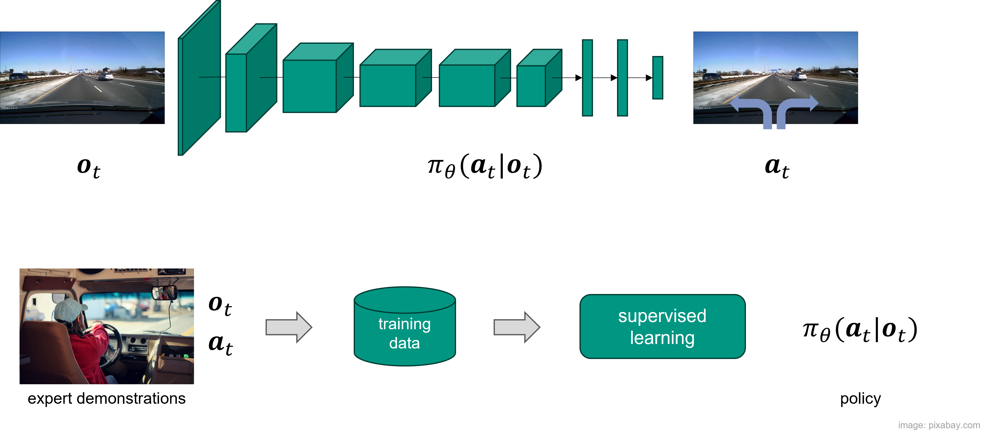
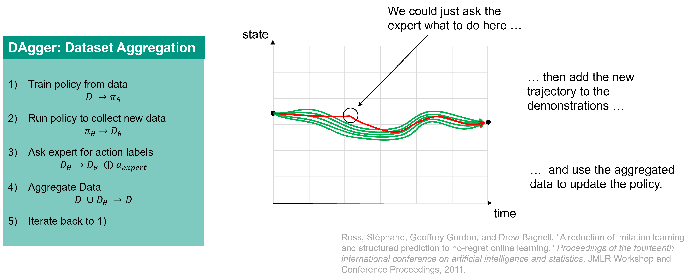
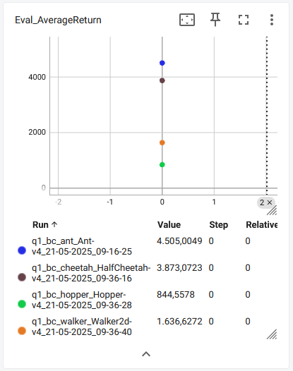
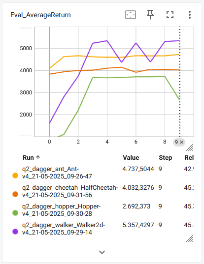

# MLRS2 Exercise 7 - Imitation Learning with Behavioral Cloning and DAgger

In this exercise, you will implement behavioral cloning and DAgger to learn policies from expert demonstrations.
In lieu of a human demonstrator, demonstrations will be provided via an expert policy that we have trained for you.
You will use the MuJoCo tasks from OpenAI Gym, and you will implement a neural network policy using PyTorch.

<table style="border-collapse: collapse; border: none;">
  <tr style="border: none;">
    <td align="center" style="border: none;">
      <a href="https://gymnasium.farama.org/environments/mujoco/ant/">
        <br>
        Ant
      </a>
    </td>
    <td align="center" style="border: none;">
      <a href="https://gymnasium.farama.org/environments/mujoco/half_cheetah/">
        <br>
        Half Cheetah
      </a>
    </td>
    <td align="center" style="border: none;">
      <a href="https://gymnasium.farama.org/environments/mujoco/hopper/">
        <br>
        Hopper
      </a>
    </td>
    <td align="center" style="border: none;">
      <a href="https://gymnasium.farama.org/environments/mujoco/walker2d/">
        <br>
        Walker2d
      </a>
    </td>
  </tr>
</table>

### Recap: Behavioral Cloning

In behavioral cloning, we train a policy to imitate an expert by minimizing the difference between the expert's actions and the actions taken by the policy in the same state. The training data consists of state-action pairs collected from the expert policy.



### Recap: DAgger

In DAgger, we iteratively collect data from the expert policy and use it to train the imitation policy. In each iteration, we sample a batch of states from the current policy, query the expert for the corresponding actions, and add these state-action pairs to the training data. This process continues until convergence.



## Setup

You can run this code on your own machine, no need for a GPU.
We strongly recommend you use Conda or Virtual environment to manage your Python environment and dependencies.
You will need to install MuJoCo and some Python packages; see [installation.md](installation.md) for instructions.

## Complete the code

The starter code provides an expert policy for each of the MuJoCo tasks in OpenAI Gym. Fill in the blanks
in the code marked with TODO to implement behavioral cloning.

We recommend that you read the files in the following order.
 - [scripts/run_code.py](mlrs2/scripts/run_code.py) (training loop)
 - [policies/MLP_policy.py](mlrs2/policies/MLP_policy.py) (policy definition)
 - [infrastructure/replay_buffer.py](mlrs2/infrastructure/replay_buffer.py) (stores training trajectories)
 - [infrastructure/utils.py](mlrs2/infrastructure/utils.py) (utilities for sampling trajectories from a policy)
 - [infrastructure/pytorch_utils.py](mlrs2/infrastructure/pytorch_utils.py) (utilities for converting between NumPy/Pytorch)


Fill in sections marked with `TODO`. In particular, edit
 - [policies/MLP_policy.py](mlrs2/policies/MLP_policy.py): _forward_ and _update_ methods
 - [infrastructure/utils.py](mlrs2/infrastructure/utils.py): _sample_trajectories_ method
 - [scripts/run_code.py](mlrs2/scripts/run_code.py): _run_training_loop_ method


## Run the code

Tip: While debugging, you probably want to keep the flag `--video_log_freq -1` which will disable video logging and speed up the experiment. However, feel free to remove it to save videos of your awesome policy!

### Section 1 (Behavior Cloning)
Command for section 1:

Ant environment:

```bash
python mlrs2/scripts/run_code.py --expert_policy_file mlrs2/policies/experts/Ant.pkl --env_name Ant-v4 --exp_name bc_ant --n_iter 1 --expert_data mlrs2/expert_data/expert_data_Ant-v4.pkl --video_log_freq -1
```

HalfCheetah environment:

```bash
python mlrs2/scripts/run_code.py --expert_policy_file mlrs2/policies/experts/HalfCheetah.pkl --env_name HalfCheetah-v4 --exp_name bc_cheetah --n_iter 1 --expert_data mlrs2/expert_data/expert_data_HalfCheetah-v4.pkl --video_log_freq -1
```

Hopper environment:

```bash
python mlrs2/scripts/run_code.py --expert_policy_file mlrs2/policies/experts/Hopper.pkl --env_name Hopper-v4 --exp_name bc_hopper --n_iter 1 --expert_data mlrs2/expert_data/expert_data_Hopper-v4.pkl --video_log_freq -1
```

Walker2d environment:

```bash
python mlrs2/scripts/run_code.py --expert_policy_file mlrs2/policies/experts/Walker2d.pkl --env_name Walker2d-v4 --exp_name bc_walker --n_iter 1 --expert_data mlrs2/expert_data/expert_data_Walker2d-v4.pkl --video_log_freq -1
```

To generate videos of the policy, remove the `--video_log_freq -1` flag.

### Section 2 (DAgger)
Command for section 1:
(Note the `--do_dagger` flag, and the higher value for `n_iter`)

Ant environment:

```bash
python mlrs2/scripts/run_code.py --expert_policy_file mlrs2/policies/experts/Ant.pkl --env_name Ant-v4 --exp_name dagger_ant --n_iter 10 --do_dagger --expert_data mlrs2/expert_data/expert_data_Ant-v4.pkl --video_log_freq -1
```

HalfCheetah environment:

```bash
python mlrs2/scripts/run_code.py --expert_policy_file mlrs2/policies/experts/HalfCheetah.pkl --env_name HalfCheetah-v4 --exp_name dagger_cheetah --n_iter 10 --do_dagger --expert_data mlrs2/expert_data/expert_data_HalfCheetah-v4.pkl --video_log_freq -1
```

Hopper environment:

```bash
python mlrs2/scripts/run_code.py --expert_policy_file mlrs2/policies/experts/Hopper.pkl --env_name Hopper-v4 --exp_name dagger_hopper --n_iter 10 --do_dagger --expert_data mlrs2/expert_data/expert_data_Hopper-v4.pkl --video_log_freq -1
```

Walker2d environment:

```bash
python mlrs2/scripts/run_code.py --expert_policy_file mlrs2/policies/experts/Walker2d.pkl --env_name Walker2d-v4 --exp_name dagger_walker --n_iter 10 --do_dagger --expert_data mlrs2/expert_data/expert_data_Walker2d-v4.pkl --video_log_freq -1
```


## Visualization the saved tensorboard event file:

You can visualize your runs using tensorboard:
```bash
tensorboard --logdir data
```

You will see scalar summaries as well as videos of your trained policies (in the 'images' tab).

You can choose to visualize specific runs with a comma-separated list:
```bash
tensorboard --logdir data/run1,data/run2,data/run3...
```

### Example output on Tensorboard

For behavioural cloning, we run only one iteration (with 1000 training steps), therefore we only see one point in the plot.
For DAgger, we run 10 iterations (with 1000 training steps each), therefore we see a line plot with 10 points. With DAgger, the performance improves with each iteration.

<table style="border-collapse: collapse; border: none;">
  <tr style="border: none;">
    <td align="center" style="border: none;">
      <br>
      Result for BC
    </td>
    <td align="center" style="border: none;">
      <br>
      Result for DAgger
    </td>
  </tr>
</table>

